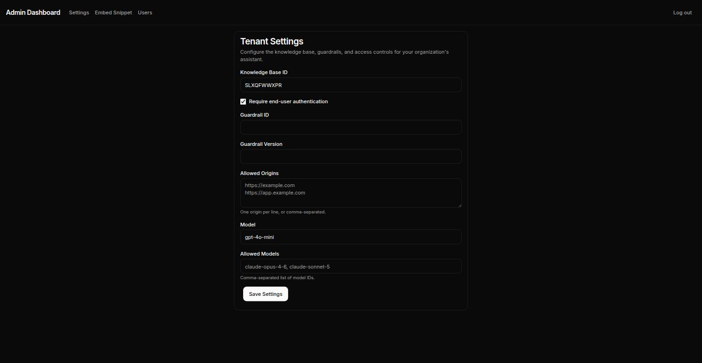
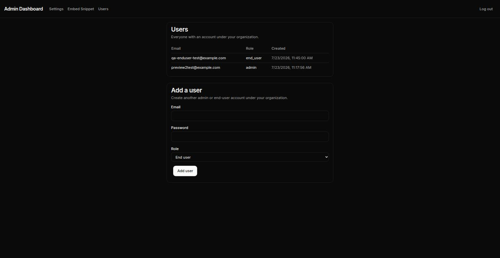
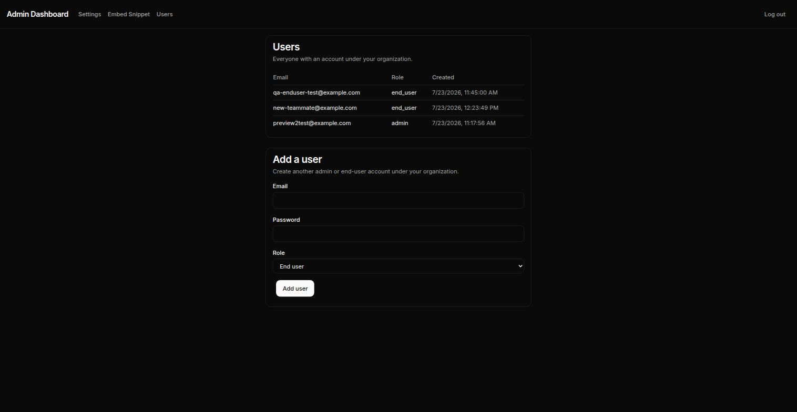
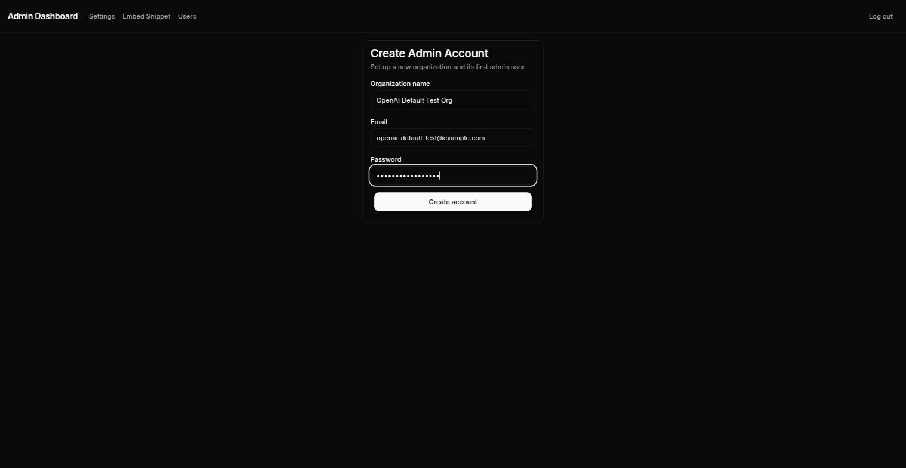

# Manual QA Results — 2026-07-23

Run against the live preview deployment: https://worktree-auth-multitenancy-guardrails.d2l47euepvccx6.amplifyapp.com (Amplify app `d2l47euepvccx6`, branch `worktree-auth-multitenancy-guardrails`). Checklist source: `BACKLOG.md` in the project memory directory.

**First round (items 1–10): all pass.** **Follow-up round (items 11–15): 14 pass, 1 fix pending re-verification** — see below.

## Results

| # | Test | Result | Notes |
|---|---|---|---|
| 1 | Signup creates `Tenant` + `User` rows | ✅ Pass | Confirmed via direct DynamoDB reads — matching `tenantId`, correct `role: admin` |
| 2 | Login with correct/wrong password | ✅ Pass | Correct password establishes a session (`/api/auth/session` returns user data); wrong password returns a null session |
| 3 | Session carries `role`/`tenantId` | ✅ Pass | Confirmed via `/api/auth/session` |
| 4 | `/admin/*` gating (unauthenticated + non-admin) | ✅ Pass | Unauthenticated → 307 redirect to `/admin/login`. Inserted a synthetic `end_user` account directly into DynamoDB (no product flow creates one) and confirmed a valid `end_user` session is also redirected |
| 5 | Embed token `?t=` cross-context bridge | ✅ Pass | Rendered in a genuinely cross-origin iframe (separate local origin) with no framing block; server logs confirm the real `/api/chat` call resolved the tenant from the query-param token, not a cached/default one |
| 6 | Cross-tenant isolation under concurrency | ✅ Pass | Fired two genuinely concurrent `/api/chat` requests (~19ms apart, interleaved in the same Lambda log stream) from two tenants with different `knowledgeBaseId` values. Each request used only its own tenant's KB ID — zero cross-contamination. Strongest re-validation of the original `process.env` global-mutation credential leak |
| 7 | `/api/chat` 401s, `/api/logs` 403s | ✅ Pass | Missing/tampered/expired tenant token → 401 with correct error messages. `/api/logs`: 401 unauthenticated, 403 for `end_user` role, passes auth gate for admin |
| 8 | Guardrail trigger test | ✅ Pass | A prompt-injection message (`PROMPT_ATTACK` filter) was blocked pre-LLM (`"thinking":"Blocked by guardrail"`), safe substitute response returned instead of reaching the model |
| 9 | `requireEndUserAuth` toggle | ✅ Pass | Verified live via the real `PATCH /api/admin/tenant` endpoint in both directions — anonymous chat blocked when `true`, allowed past the auth gate when `false` |
| 10 | Fresh tenant (empty `guardrailId`) can chat | ✅ Pass | Request reached the generic downstream error, not the guardrail fail-closed message — confirms the final-review regression fix holds |

## Issues found (not blocking, flagged for follow-up)

1. **`ANTHROPIC_API_KEY` on this deployment is a literal placeholder string** (`"your-anthropic-api-key"`), not a real key. Every test needing a full LLM completion fails downstream with `invalid_api_key` / `invalid x-api-key`. Items 6, 8, and 10 were designed to test the pre-LLM logic directly (tenant resolution, guardrail gating) so results above are unaffected, but no test produced an actual chat response. See discussion of root cause and options in the session notes / memory.
2. **One tenant record has unexplained malformed defaults.** `tenantId 01KY835JVABB3J9KK53MDVYPNE` ("Preview2 Test") — the very first successful signup after the env-var fix deployed — has `model: "gpt-4o-mini"`, `requireEndUserAuth: true`, and an extra `allowedModels: []` field, none of which appear anywhere in `signup/route.ts`'s current or historical source. Every other tenant (7 of 8) has the correct code-defined defaults. Not root-caused; isolated to this one record.
3. **No logout mechanism exists in the UI.** There is no `signOut()` call anywhere in the codebase — not a missing link, the functionality itself was never wired up.

## Test data left on the preview app

- Synthetic `end_user` account: `qa-test-enduser-01` (tenant `01KY835JVABB3J9KK53MDVYPNE`)
- Tenant "Preview2 Test2" (`01KY83G0J4RB52AH95TKZ3CHN8`) reconfigured with a fake KB ID (`FAKE-KB-TENANT2-ISOLATION-TEST`) and the real Bedrock guardrail (`fvsirf90zt71`/`1`) attached, for isolation/guardrail testing

All harmless preview-only data — flag if you want it cleaned up before merge.

---

## Follow-up round — logout button, OpenAI default, tenant Users feature

Same deployment. Covers the three follow-up changes: the admin logout button, switching new-tenant defaults from Anthropic to OpenAI, and the new tenant-scoped Users list + add-user feature (with its supporting `tenantId-index` GSI on the Users table). Run via live browser interaction (screenshots below) plus direct API/DynamoDB verification.

| # | Test | Result | Notes |
|---|---|---|---|
| 11 | Admin logout button | ⚠️ Bug found, fix committed but **not yet verified live** | Clicking "Log out" clears the session server-side (`__Secure-authjs.session-token` cookie correctly expired) but redirects to `https://localhost:3000/admin/login` instead of the real domain — confirmed via the raw `Location` header on `/api/auth/signout`. Root cause: Auth.js's `trustHost` governs which *incoming* hosts are accepted, but constructing *outgoing* redirect URLs (like `signOut`'s `callbackUrl`) needs `AUTH_URL` explicitly set, which this deployment never had — Auth.js falls back to `localhost:3000`. Fix (commit `d806cc8`): bake `AUTH_URL=https://${AWS_BRANCH}.${AWS_APP_ID}.amplifyapp.com` into `.env.production` at build time, using Amplify's own automatic build variables so it isn't hardcoded to one app. **Committed locally, intentionally not pushed yet** (bundling with more changes) — needs a redeploy + re-test before this can be marked passing. |
| 12 | New signups default to OpenAI, not Anthropic | ✅ Pass | Signed up a fresh admin ("OpenAI Default Test Org") through the real UI. Confirmed via direct DynamoDB read: `llmProviderDefaults: { provider: "openai", model: "gpt-4o-mini" }`. Screenshots: form filled (04), post-signup Tenant Settings showing `Model: gpt-4o-mini` (05) |
| 13 | Tenant Users list displays correctly | ✅ Pass | `/admin/users` for the "Preview2 Test" tenant shows exactly its 2 users (the admin + the synthetic `end_user`) — matches a direct `tenantId-index` GSI query run from the CLI. Screenshot 02 |
| 14 | Add-user form works, never leaks `passwordHash` | ✅ Pass | Added `new-teammate@example.com` (end_user) via the real form; appeared in the table immediately (screenshot 03). Inspected the raw `GET /api/admin/users` response body directly — `passwordHash` is absent from every user object, by design (`route.ts` explicitly strips it before responding) |
| 15 | Users list is tenant-isolated | ✅ Pass | Logged in as a *different* tenant's admin ("Preview2 Test2") and confirmed `/api/admin/users` returns only that tenant's single user — none of "Preview2 Test"'s 3 users are visible. Query is scoped server-side via `getUsersByTenant(session.user.tenantId)`, never client-supplied |

### Screenshots

1. `01-admin-login-success.jpg` — logged in as the "Preview2 Test" admin, landing on Tenant Settings
2. `02-users-list-initial.jpg` — `/admin/users` showing the tenant's 2 existing users
3. `03-add-user-success.jpg` — table updated immediately after adding `new-teammate@example.com`
4. `04-signup-form-filled.jpg` — new admin signup form filled out for the OpenAI-default test
5. `05-signup-success-openai-default.jpg` — post-signup Tenant Settings confirming `Model: gpt-4o-mini` and `requireEndUserAuth` unchecked

### New infrastructure this round

- Added GSI `tenantId-index` (partition key `tenantId`) to `CustomerSupportAgent-Users` — backfilled successfully, confirmed `ACTIVE` and returning correct results before the feature was tested.

### Outstanding

- Re-test item 11 (logout) once the `AUTH_URL` fix (commit `d806cc8`) is pushed and deployed.
- Issue #3 from the first round ("No logout mechanism exists") is now addressed in code, pending the above verification.
